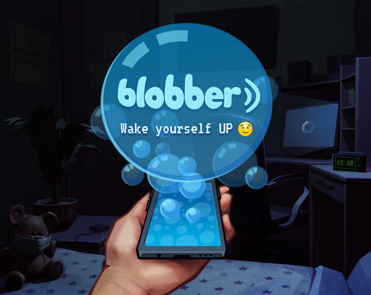

# Blobber

## Description

A puzzle game set in the modern world of social networks. You play as an ordinary user of a social network for quick messaging called “Blobber” who spends all his free time scrolling through the news feed. But everything changes when the user opens an ordinary, at first glance, gif with kittens.

The player needs to solve puzzles in order to collect the encryption key parts from the puzzles answers, use the key and get out of the control of the social network.

You can play it [here](https://konh.itch.io/blobber-improved).

You can rate it [here](https://ldjam.com/events/ludum-dare/47/blobber).

## Credits
- Development - [Kvinster](https://github.com/Kvinster), [KonH](https://github.com/KonH) 
- Game-design - Alina Vishenko
- Art - [FireFly](https://www.artstation.com/firefly_ff)

## Thanks
- Filler content by [Sushant Kumar](https://twitter.com/sushant_kumar/status/1283314235842297856)
- Glitch effects by [Keijiro Takahashi](https://github.com/keijiro/KinoGlitch)
- LoopScrollRect by [Kanglai Qian](https://github.com/qiankanglai/LoopScrollRect)